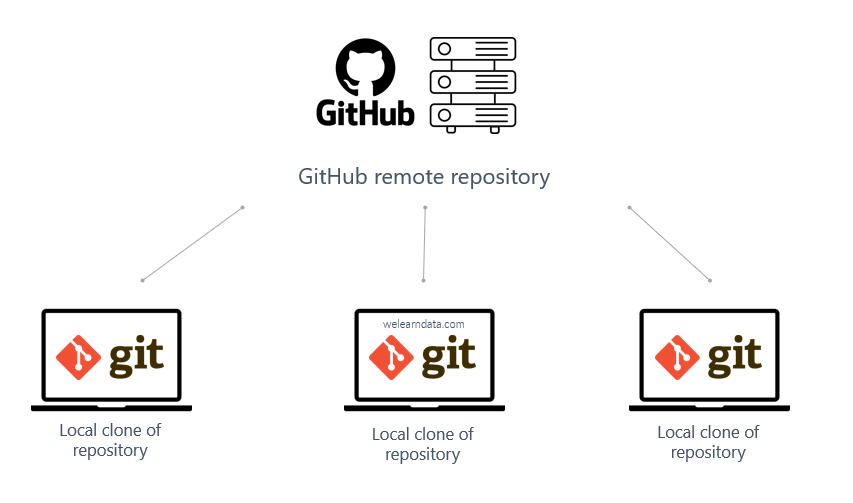
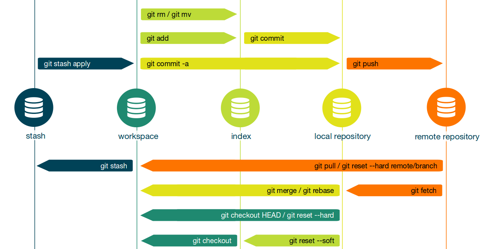
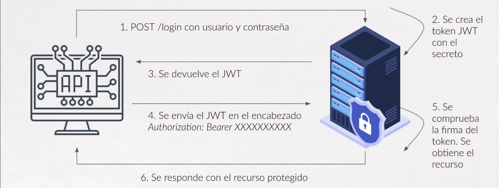
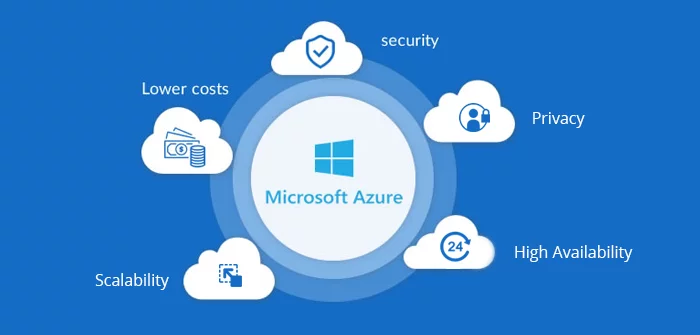
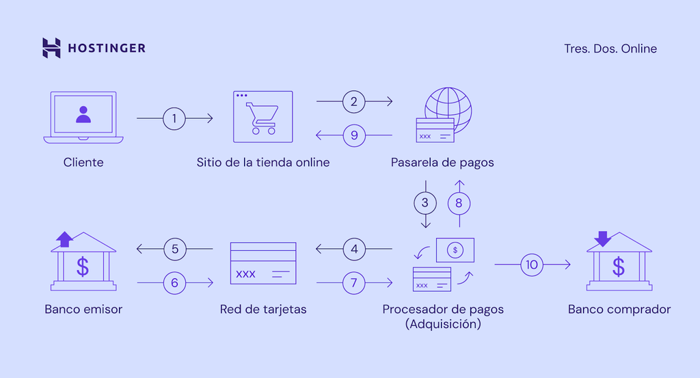

# 📄 Documentación técnica  
💻 **Laboratorio 1 – Tecnologías Web Modernas**  

**Nombre:** Dylan Montiel Zúñiga

**Carné:**  2023205654

**Curso:** IC-8057 – Introducción al Desarrollo de Páginas Web  

**Fecha:**  8/8/2025

---

## 1. Frameworks de desarrollo web
### a. ¿Qué es un framework y qué problema resuelve?

En el desarrollo de software, un **framework** es un conjunto de herramientas, bibliotecas y convenciones que proporciona una estructura base para crear aplicaciones de manera más rápida, organizada y eficiente. Su objetivo es evitar que los desarrolladores tengan que reinventar soluciones comunes, promoviendo la reutilización de código y el uso de estándares que faciliten la escalabilidad, el mantenimiento y la colaboración en equipo. Al establecer una arquitectura y una serie de reglas claras, un framework permite centrarse en la lógica del negocio y la experiencia del usuario, mientras gestiona tareas técnicas repetitivas o complejas.

En el contexto del desarrollo web, **Next.js** es un framework basado en React que ofrece funcionalidades avanzadas listas para usar, como **renderización del lado del servidor (SSR)**, **generación estática (SSG)**, enrutamiento automático, optimización de imágenes y soporte para API Routes. Gracias a estas características, Next.js resuelve problemas comunes como el SEO deficiente de las SPA, la carga inicial lenta y la organización del código, proporcionando un entorno que combina rendimiento, flexibilidad y buenas prácticas de desarrollo moderno.


### b. Arquitectura general y enfoque 
## SSR
En la **renderización del lado del servidor (SSR)**, el navegador recibe una página completamente generada por el servidor en el momento en que se solicita, evitando que el usuario espere varios segundos a que se carguen componentes individuales. El servidor obtiene la información desde una base de datos o un CMS mientras el usuario navega, y luego envía el resultado listo para mostrar.

## SSG
A diferencia de las SPA, que cargan todo su contenido dentro de una única página HTML renderizada tras la solicitud del cliente, los **generadores de sitios estáticos** siguen un enfoque distinto para gestionar el contenido y construir las páginas.

En este caso, el contenido se genera en el momento de crear nuevas páginas o al actualizar el existente. Al producir sitios completamente estáticos, no es necesario renderizar las páginas en respuesta a cada solicitud del usuario, lo que garantiza que el contenido se mantenga igual para todos los visitantes, sin importar cuándo o desde dónde accedan.

### c. Ejemplo práctico documentado  
### Estructura de proyecto

Next.js sigue convenciones claras para organizar carpetas y archivos en la raíz del proyecto, facilitando la estructura, el mantenimiento y la escalabilidad de las aplicaciones.

#### Carpetas principales (Top-level folders)  
- `app` — Carpeta para el **App Router** (nuevo sistema de enrutamiento).  
- `pages` — Carpeta para el **Pages Router** (enrutamiento tradicional basado en archivos).  
- `public` — Archivos estáticos accesibles públicamente (imágenes, fuentes, favicon, etc.).  
- `src` — Carpeta opcional para código fuente de la aplicación (organización alternativa).  

#### Archivos principales (Top-level files)  
- `next.config.js` — Archivo de configuración general de Next.js.  
- `package.json` — Define dependencias, scripts y metadata del proyecto.  
- `instrumentation.ts` — Archivo para OpenTelemetry e instrumentación (opcional).  
- `middleware.ts` — Middleware para peticiones Next.js.  
- `.env`, `.env.local`, `.env.production`, `.env.development` — Variables de entorno según el ambiente.  
- `.eslintrc.json` — Configuración de ESLint para análisis de código.  
- `.gitignore` — Define qué archivos/carpetas ignorar en Git.  
- `next-env.d.ts` — Declaraciones TypeScript específicas para Next.js.  
- `tsconfig.json` — Configuración de TypeScript.  
- `jsconfig.json` — Configuración para JavaScript (paths y opciones).  

#### Convenciones de archivos especiales  
| Archivo       | Extensiones           | Uso                         |
|---------------|----------------------|-----------------------------|
| `_app`        | `.js`, `.jsx`, `.tsx`| Componente personalizado App |
| `_document`   | `.js`, `.jsx`, `.tsx`| Documento HTML personalizado |
| `_error`      | `.js`, `.jsx`, `.tsx`| Página de error personalizada |
| `404`         | `.js`, `.jsx`, `.tsx`| Página para error 404         |
| `500`         | `.js`, `.jsx`, `.tsx`| Página para error 500         |

#### Convenciones para rutas (Routes)  

##### Estructura de carpetas  
| Ruta de carpeta          | Archivo            | Descripción           |
|-------------------------|--------------------|-----------------------|
| `index`                 | `.js`, `.jsx`, `.tsx` | Página principal (home) |
| `folder/index`          | `.js`, `.jsx`, `.tsx` | Página anidada dentro de carpeta |

##### Convenciones de archivos  
| Nombre de archivo       | Extensiones           | Descripción           |
|------------------------|-----------------------|-----------------------|
| `index`                | `.js`, `.jsx`, `.tsx` | Página principal (home) |
| `file`                 | `.js`, `.jsx`, `.tsx` | Página anidada         |


#### Estructura de proyecto (Next.js con Pages Router)

```
my-next-app/
├── pages/
│   ├── index.js         # Página principal
│   ├── about.js         # Otra página estática
│   └── api/
│       └── hello.js     # Ejemplo de API Route
├── public/              # Recursos estáticos (imágenes, íconos, etc.)
├── styles/              # Archivos CSS y módulos de estilos
│   ├── globals.css
│   └── Home.module.css
├── package.json         # Dependencias y scripts
└── next.config.js       # Configuración de Next.js
```

#### Fragmento de código comentado – Página estática con `getStaticProps`

```jsx
// pages/index.js
export default function Home({ date }) {
  return (
    <div>
      <h1>Bienvenido a mi sitio con Next.js</h1>
      <p>Última generación del contenido: {date}</p>
    </div>
  )
}

// Esta función se ejecuta en build time
export async function getStaticProps() {
  return {
    props: {
      date: new Date().toLocaleString(), // Fecha de compilación
    },
  }
}
```

* `getStaticProps` es una función especial de Next.js que permite **generar contenido estático en tiempo de compilación** (SSG).
* El HTML resultante se sirve de forma inmediata a todos los usuarios, lo que mejora el rendimiento y mantiene el contenido consistente hasta la próxima compilación.
* Ideal para páginas con contenido que no cambia con cada visita del usuario.

### d. Comparación breve entre al menos dos frameworks
| Característica       | Next.js                                  | Gatsby                                  |
|----------------------|-----------------------------------------|----------------------------------------|
| **Enfoque**              | Framework híbrido (SSR, SSG, ISR, SPA)  | Generador de sitios estáticos (SSG)    |
| **Renderización**        | Soporta renderizado del lado servidor y generación estática dinámica | Enfocado principalmente en generación estática pura |
| **Flexibilidad**         | Alta, permite API Routes y middleware   | Más enfocado en sitios estáticos y blogs |
| **Curva de aprendizaje** | Moderada, integra React y Node.js       | Moderada, con enfoque en GraphQL y plugins |
| **Ecosistema**           | Amplio soporte, integración con Vercel | Gran comunidad para sitios estáticos   |
| **Casos de uso**        | Aplicaciones web dinámicas y sitios con contenido cambiante | Sitios con contenido estático y rápido SEO |
---


## 2. Control de versiones y trabajo colaborativo
<div style="text-align: center;">
  
</div>

### a. ¿Qué es el control de versiones y por qué es esencial?
Un sistema de control de versiones es una herramienta que guarda un historial de las modificaciones hechas a uno o varios archivos a lo largo del tiempo, permitiendo recuperar versiones anteriores cuando sea necesario. Aunque comúnmente se utiliza para gestionar archivos de código fuente, este sistema puede aplicarse prácticamente a cualquier tipo de archivo almacenado en un computador.

### b. Conceptos clave  
#### Repositorio
Un repositorio Git es un espacio donde se almacena y gestiona el código de un proyecto, registrando todos los cambios realizados para llevar un control de versiones. Puede ser local, ubicado en la máquina del desarrollador para trabajar de forma independiente, o remoto, alojado en un servidor para facilitar la colaboración y sincronización entre varios desarrolladores. Plataformas como GitHub, GitLab y Bitbucket ofrecen servicios para alojar repositorios remotos.

#### Commit
Captura del estado de los archivos del repositorio en un momento específico, que guarda de forma voluntaria las modificaciones seleccionadas por el desarrollador. Cada commit posee un identificador único llamado *hash* o *SHA-1*, que lo distingue dentro del historial de versiones. Este historial permite rastrear y revertir cambios, facilitar el trabajo colaborativo y mantener un registro claro del progreso del proyecto.

#### Branch  
Línea de desarrollo independiente creada a partir de un commit específico, que permite trabajar en cambios separados del *main* o *master*. Cada rama parte como una copia exacta del commit inicial y puede recibir nuevos commits sin afectar otras ramas, lo que facilita experimentar, desarrollar funciones o corregir errores sin interferir con el trabajo ajeno. Son esenciales para organizar tareas en paralelo, aislar desarrollos y favorecer la colaboración en equipo.

#### Merge  
Operación que combina los cambios de una rama con otra existente en el repositorio, creando un nuevo *commit* que integra ambas líneas de desarrollo. Se utiliza principalmente para incorporar cambios de una rama secundaria (por ejemplo, una de desarrollo de nuevas funciones) a la rama principal (*master* o *main*). Durante el proceso, Git aplica las modificaciones de la rama de origen a la de destino; si un mismo archivo fue editado en ambas, pueden surgir conflictos que el usuario debe resolver manualmente antes de completar la fusión.

#### Pull Request  
Función que permite a los desarrolladores proponer cambios a un repositorio para que sean revisados y, eventualmente, fusionados en una rama específica, generalmente la principal. En proyectos colaborativos en GitHub, es común trabajar en una rama independiente (feature branch), realizar los cambios y luego enviar un pull request al repositorio original para que los responsables revisen, comenten y discutan las modificaciones antes de integrarlas, siguiendo el flujo de trabajo conocido como Git Flow.

### c. Flujos de trabajo comunes
<div style="text-align: center;">
  
</div>

#### Git Flow

El desarrollo se organiza en ramas específicas para diferentes propósitos: la rama `main` o `master` para versiones estables, una rama `develop` para integrar nuevas funciones, y ramas temporales como *feature branches*, *release branches* y *hotfixes* para cambios concretos. El *pull request* es clave para integrar el trabajo, permitiendo revisión y discusión antes de la fusión. Es ideal para proyectos con ciclos de desarrollo estructurados y lanzamientos planificados.

#### Trunk-Based

Se centra en mantener una sola rama principal activa (el *trunk*), donde los desarrolladores integran cambios pequeños y frecuentes, normalmente varias veces al día. Se usan ramas cortas de vida muy breve o directamente *feature toggles* para no interrumpir la estabilidad del código. Favorece la integración continua y reduce conflictos, pero requiere alta coordinación y pruebas automatizadas.

#### Feature Branches

Cada nueva funcionalidad o cambio importante se desarrolla en su propia rama, derivada de la principal. Una vez completada y probada, se integra mediante un *pull request* que permite revisión y validación del código. Es un enfoque flexible que facilita el trabajo paralelo, pero si las ramas viven demasiado tiempo pueden generar conflictos al fusionar.

### d. Ejemplo de uso de Git en un proyecto

#### Inicialización

Se inicia el repositorio con `git init`, lo que crea un directorio `.git` para almacenar el historial de cambios y configuraciones del proyecto. También se puede clonar un repositorio existente con `git clone <url>` para trabajar sobre una copia local.

#### Commits

Después de realizar cambios en los archivos, se agregan al área de preparación con `git add <archivo>` o `git add .` y se registran en el historial con `git commit -m "Mensaje descriptivo"`. Cada commit representa un punto seguro al que se puede volver.

#### Ramas

Para desarrollar nuevas funcionalidades sin afectar la rama principal, se crean ramas con `git branch <nombre>` y se cambian con `git checkout <nombre>` o directamente `git switch -c <nombre>`. Al finalizar el desarrollo, se integran a la rama principal mediante `git merge` o pull requests en plataformas como GitHub.


### e. Herramientas recomendadas  
#### GitHub
GitHub es la plataforma Git en la nube más popular y ampliamente utilizada en el mundo del desarrollo de software. Su interfaz es intuitiva y fácil de usar, lo que facilita la colaboración entre equipos a través de funcionalidades como pull requests, revisión de código y seguimiento de issues. GitHub también ofrece herramientas integradas para documentación y gestión de proyectos, además de un ecosistema robusto de aplicaciones y automatizaciones, como GitHub Actions, que permiten implementar pipelines de integración continua y despliegue. Su amplia comunidad y la gran cantidad de proyectos alojados facilitan una curva de aprendizaje suave para nuevos usuarios, consolidándola como la opción preferida para muchos desarrolladores y organizaciones.

#### GitLab
GitLab es una plataforma Git de código abierto que se puede utilizar tanto en la nube como en instalaciones propias. Se destaca por ser una solución integral que abarca todo el ciclo de vida del desarrollo de software, incluyendo planificación, desarrollo, pruebas, seguridad, despliegue y monitoreo. Su sistema de revisión de código con merge requests incluye funcionalidades avanzadas como checklists inline y vistas previas en vivo, facilitando una colaboración más detallada. Además, GitLab ofrece herramientas avanzadas de gestión de proyectos que soportan metodologías ágiles y marcos escalables, así como funciones de seguridad especializadas para detectar vulnerabilidades en código, contenedores e infraestructura como código. Esta plataforma está orientada no solo a desarrolladores, sino también a otros roles como gerentes de producto, diseñadores y equipos de aseguramiento de calidad.

#### Bitbucket
Bitbucket, mantenido por Atlassian, es una plataforma Git que se integra profundamente con el ecosistema de herramientas de Atlassian, especialmente Jira. Aunque ofrece un conjunto básico de funcionalidades para control de versiones, revisión de código y pipelines para integración y entrega continua, su mayor fortaleza radica en la vinculación estrecha con la gestión de proyectos mediante Jira. Esto permite a los equipos relacionar commits, ramas y pull requests directamente con issues y proyectos, facilitando un flujo de trabajo más coordinado. Sin embargo, Bitbucket es menos extensible y con menos funciones que GitHub o GitLab, por lo que resulta más adecuado para equipos que ya utilizan productos Atlassian y buscan una integración nativa dentro de ese entorno.


---

## 3. Autenticación y seguridad moderna
### a. Conceptos  
#### Autenticación
La autenticación es el proceso mediante el cual se verifica la identidad de un usuario o sistema para confirmar que es quien afirma ser. Este mecanismo actúa como la primera barrera contra accesos no autorizados. Tradicionalmente, se realiza mediante credenciales como nombres de usuario y contraseñas, pero también puede incluir métodos más avanzados como autenticación biométrica, tokens de seguridad o autenticación multifactor. Su objetivo principal es asegurar que solo los usuarios legítimos puedan ingresar a un sistema o aplicación.  

#### Autorización  
Una vez que un usuario ha sido autenticado, entra en juego la autorización, que determina qué recursos, funcionalidades o datos específicos puede acceder dicho usuario. Mientras que la autenticación responde a la pregunta "¿Quién eres?", la autorización responde a "¿Qué tienes permiso para hacer?". Por ejemplo, un usuario común puede tener permisos para leer cierta información, mientras que un administrador podría tener acceso adicional para modificarla o eliminarla. Este proceso es esencial para mantener la seguridad y la privacidad dentro de sistemas multiusuario.

#### Tokens  
Los tokens son credenciales digitales que actúan como llaves de acceso temporales y seguras. A diferencia de las contraseñas, que son estáticas y pueden ser vulnerables, los tokens suelen ser dinámicos y tener un tiempo de vida limitado. Existen dos tipos principales: tokens opacos, que requieren validación con el servidor que los emitió (como en OAuth), y tokens autodescriptivos, como los JWT, que contienen toda la información necesaria para su verificación sin necesidad de consultar una base de datos. Su uso reduce riesgos, ya que evita la exposición constante de credenciales sensibles.

#### JWT  
Los JWT son un estándar abierto basado en JSON que permite transmitir información entre partes de manera segura y compacta. Están compuestos por tres partes: un encabezado que especifica el algoritmo de firma, una carga útil con datos relevantes (como el ID del usuario o roles), y una firma digital que garantiza la integridad del token.

#### OAuth  
OAuth es un protocolo de autorización diseñado para permitir que aplicaciones de terceros accedan a recursos protegidos sin necesidad de compartir credenciales directas. La versión más utilizada, OAuth 2.0, opera mediante un flujo donde el usuario autoriza a una aplicación a acceder a sus datos en otro servicio (como Gmail), obteniendo la aplicación un token de acceso limitado.

### b. Diagrama de flujo explicativo del proceso de autenticación con JWT
<div style="text-align: center;">
  
</div>

### c. Buenas prácticas en seguridad web

- **Realizar Auditorías de Seguridad Periódicas:** Evalúa de manera constante tu aplicación web para identificar vulnerabilidades. Contar con profesionales en ciberseguridad puede ayudar a detectar fallos críticos y priorizar su corrección.
- **Implementar Cifrado SSL/TLS:** Usa HTTPS para proteger los datos en tránsito entre el cliente y el servidor. Esto evita interceptaciones y garantiza la integridad de la información sensible, como credenciales o datos financieros.

- **Utilizar Firewalls de Aplicaciones Web (WAF):** Un WAF monitorea y bloquea amenazas en tiempo real, como ataques DDoS, inyecciones SQL o XSS. Herramientas como Cloudflare o Barracuda ofrecen soluciones robustas.

- **Validar y Sanitizar Entradas de Usuarios:** Previene ataques como inyección SQL o XSS al validar y limpiar todos los datos ingresados por los usuarios. Nunca confíes en entradas sin procesar.

- **Gestionar Correctamente las Sesiones:** Implementa tokens seguros (como JWT) con tiempos de expiración cortos, inválidalos al cerrar sesión y evita almacenar datos sensibles en cookies o LocalStorage.

- **Actualizar Software y Dependencias:** Mantén el servidor, frameworks, bibliotecas y plugins actualizados para parchar vulnerabilidades conocidas. La desconfiguración es una puerta abierta para ataques.

- **Monitoreo y Registro de Actividades (Logging):** Herramientas como Graylog o Logstash permiten rastrear incidentes, identificar brechas y analizar patrones de ataque para responder rápidamente.

- **Restringir Permisos y Aplicar el Principio de Mínimo Privilegio:** Limita el acceso de usuarios y sistemas solo a lo necesario. Esto minimiza daños en caso de compromiso.

- **Educar al Equipo y Usuarios:** Capacita a desarrolladores en prácticas seguras y conciencia a usuarios sobre phishing y contraseñas robustas.

### d. Aplicaciones reales en plataformas modernas

#### Azure
<div style="text-align: center;">
  
</div>


Microsoft Azure implementa un enfoque multicapa para proteger tanto los datos de la plataforma como los de sus usuarios, combinando tecnologías avanzadas y marcos de cumplimiento globales.

1. **Cifrado de Datos**:  
   Azure utiliza cifrado tanto en tránsito (TLS 1.2/1.3) como en reposo (AES-256), garantizando que la información permanezca segura en cualquier estado. Servicios como **Azure Key Vault** permiten gestionar claves de cifrado de manera centralizada y cumplir con normativas como GDPR o HIPAA.  

2. **Identidad y Acceso**:  
   Con **Azure Active Directory (AD)**, la plataforma ofrece autenticación multifactor (MFA), acceso condicional basado en riesgos y controles de identidad de "confianza cero" (Zero Trust). Esto minimiza amenazas como el robo de credenciales o accesos no autorizados.  

3. **Protección de Redes**:  
   Herramientas como **Azure Firewall** y **Network Security Groups (NSGs)** filtran el tráfico malicioso, mientras que **DDoS Protection** defiende contra ataques de denegación de servicio. La segmentación de redes virtuales (VNet) aísla cargas de trabajo críticas.  

#### Shopify
Shopify garantiza la seguridad de los datos y transacciones mediante estrictos estándares internacionales. Como plataforma certificada PCI DSS Nivel 1, asegura el procesamiento seguro de pagos con cifrado de datos de tarjetas y controles de acceso rigurosos, liberando a los comerciantes de gestionar esta complejidad.

En privacidad, facilita el cumplimiento de regulaciones como el GDPR y CCPA con herramientas integradas para gestionar consentimientos y solicitudes de usuarios. Sus certificaciones SOC 2 Tipo II y SOC 3, auditadas por terceros, validan la protección física y lógica de los sistemas, junto con una alta disponibilidad del servicio.

---

## 4. Gestores de contenido desacoplados (Headless CMS)
### a. Headless CMS vs CMS tradicional

#### Headless CMS
Un CMS headless (como Contentful o Strapi) **separa el back-end (gestión de contenido) del front-end (presentación)**. El contenido se almacena en una base de datos central y se distribuye mediante APIs a cualquier dispositivo o plataforma (web, móvil, IoT, etc.).  

#### CMS Tradicional  
Un CMS tradicional (como WordPress o Drupal) es un sistema monolítico que integra **gestión de contenido** (back-end) y **presentación** (front-end) en una sola plataforma. Ofrece una interfaz amigable para crear, editar y publicar contenido directamente en un sitio web, utilizando plantillas predefinidas para el diseño.  

### b. Arquitectura basada en APIs

La Arquitectura Basada en APIs es una filosofía de diseño donde las APIs (interfaces de programación de aplicaciones) son el núcleo central en el desarrollo y la arquitectura de software. Esta arquitectura prioriza la creación, gestión y uso de APIs para guiar el diseño y desarrollo de las aplicaciones. Las APIs se consideran elementos principales, diseñadas desde el inicio para soportar la lógica del negocio, integraciones externas y servicios front-end, facilitando la comunicación y el intercambio de funcionalidades entre plataformas y dispositivos diversos.

**Componentes clave:**

* **Microservicios:** Servicios pequeños, independientes y desplegables por separado, que se comunican mediante APIs, facilitando un desarrollo modular.
* **API Gateway:** Punto único de entrada que enruta las solicitudes a los microservicios adecuados y gestiona aspectos transversales como autenticación y control de tasa.
* **Gestión de APIs:** Conjunto de herramientas y prácticas que aseguran la seguridad, documentación y escalabilidad de las APIs.
* **Interfaces para desarrolladores:** Diseños amigables que permiten interactuar y construir sobre las APIs fácilmente.

**Beneficios principales:**

* **Escalabilidad:** Se pueden escalar componentes individuales según la demanda.
* **Flexibilidad:** Permite actualizar o agregar funcionalidades sin afectar todo el sistema.
* **Velocidad:** Facilita el trabajo simultáneo de distintos equipos en diferentes componentes, acelerando el desarrollo.
* **Innovación:** Hace sencillo incorporar nuevas tecnologías o prácticas simplemente desarrollando o actualizando APIs.

### c. Ventajas, limitaciones y casos de uso comunes

#### Ventajas:  
- **Multicanal**: El mismo contenido puede usarse en webs, apps, smartwatches, etc.  
- **Flexibilidad tecnológica**: Los desarrolladores eligen sus frameworks (React, Vue, etc.).  
- **Escalabilidad**: Ideal para entornos complejos o de alto rendimiento.  
- **Foco en contenido**: Sin restricciones de diseño predefinido.  

#### Limitaciones:  
- **Mayor complejidad inicial**: Requiere desarrollar el front-end desde cero.  
- **Sin vista previa nativa**: Necesita integraciones adicionales para previsualizar contenido.  
- **Equipo técnico necesario**: No es óptimo para usuarios sin conocimientos de desarrollo.  

#### Casos de uso comunes

1. **Sitios web con grandes volúmenes de contenido**
Cuando un sitio debe manejar y distribuir mucho contenido en múltiples canales, un CMS headless aporta la escalabilidad y flexibilidad necesarias para gestionarlo de forma centralizada. Así, se evita duplicar contenido para cada canal, ya que todo se administra desde un único repositorio que sincroniza los cambios en todos los puntos digitales. Por ejemplo, Kaplan, una empresa educativa internacional con más de 10,000 páginas, utiliza Prismic para adaptar su contenido a diferentes regiones con marcas y mensajes personalizados.

2. **Blogs y sitios de noticias**
   Estos sitios necesitan distribuir contenido multimedia y noticias a múltiples plataformas de forma rápida y consistente. Un CMS sin cabeza permite que los redactores publiquen contenido actualizado sin complicaciones técnicas. Amnistía Internacional, por ejemplo, usa Prismic para gestionar noticias y boletines a nivel global.

3. **Portafolios creativos**
   Los artistas y creativos que requieren control total sobre el diseño de su portafolio web encuentran en un CMS headless la libertad para personalizar su sitio y mostrar su trabajo de forma única. El artista francés Julien Vallon utiliza Prismic para expresar su estilo personal en línea.

4. **Aplicaciones móviles**
   En apps móviles donde el contenido debe ser dinámico y actualizado en tiempo real, un CMS headless permite obtener y mostrar datos mediante APIs. Privilee, una plataforma de membresía para gimnasios, distribuye contenido a sus apps en Android e iOS usando Prismic.

### d. Ejemplo de conexión del frontend a un CMS headless

```jsx
import React, { useEffect, useState } from "react";

function BlogPosts() {
  const [posts, setPosts] = useState([]);
  const [loading, setLoading] = useState(true);

  useEffect(() => {
    // URL de la API del CMS headless que devuelve los posts
    fetch("https://api.tucms.com/posts")
      .then((response) => response.json())
      .then((data) => {
        setPosts(data.posts);
        setLoading(false);
      })
      .catch((error) => {
        console.error("Error al cargar posts:", error);
        setLoading(false);
      });
  }, []);

  if (loading) return <p>Cargando posts...</p>;

  return (
    <div>
      <h1>Artículos del blog</h1>
      <ul>
        {posts.map((post) => (
          <li key={post.id}>
            <h2>{post.title}</h2>
            <p>{post.excerpt}</p>
          </li>
        ))}
      </ul>
    </div>
  );
}

export default BlogPosts;
```

#### Explicación

- Se usa `fetch` para hacer una llamada HTTP a la API REST del CMS headless.
- El CMS devuelve datos en formato JSON con una lista de posts.
- Los datos se guardan en el estado `posts` y luego se muestran en el componente.
- El contenido es dinámico, por lo que cualquier cambio en el CMS se reflejará automáticamente en el frontend al actualizar la página.

---

## 5. Pasarelas de pago en aplicaciones web
### a. ¿Qué es una pasarela de pago? ¿Qué rol cumple en una aplicación moderna?
<div style="text-align: center;">
  
</div>


Una **pasarela de pago** es un servicio que autoriza y procesa pagos realizados con tarjetas de débito o crédito, tanto en tiendas físicas como en comercios electrónicos. En los sitios de e-commerce, su función principal es garantizar que la información financiera del cliente se transmita de manera segura, cifrándola antes de enviarla al comerciante.

En una aplicación actual, especialmente en plataformas de comercio electrónico, la pasarela de pago actúa como el intermediario seguro entre el cliente y el comerciante. Gestiona la transferencia de datos de pago, realiza verificaciones antifraude, cifra la información sensible y coordina con bancos y redes de tarjetas para autorizar o rechazar transacciones. De esta manera, asegura que el proceso de pago sea confiable, rápido y protegido, facilitando que el usuario final complete la compra sin riesgos y que el comerciante reciba el dinero de forma segura.

### b. Requisitos comunes  
- **Cuenta de comercio:** Para poder recibir pagos, el comerciante debe contar con una cuenta de comercio o cuenta adquirente, que es una cuenta bancaria especial donde se depositan los fondos de las ventas realizadas con tarjeta. Esta cuenta permite procesar y gestionar los cobros realizados a través de la pasarela de pago.

- **Seguridad:** La seguridad es fundamental en toda pasarela de pago. Esto implica el cifrado de la información sensible del cliente (como datos de tarjetas) mediante protocolos como TLS, cumplimiento de normas internacionales como PCI DSS (Payment Card Industry Data Security Standard) y sistemas antifraude para proteger contra transacciones fraudulentas y garantizar la privacidad y confianza de los usuarios.

- **Integración técnica:** La pasarela debe poder integrarse sin problemas con la plataforma o aplicación del comerciante. Esto incluye ofrecer APIs, SDKs o plugins que permitan conectar el sistema de pago con el sitio web o app, facilitando el envío y recepción de datos de pago, validaciones, respuestas de autorización y el manejo de errores durante el proceso.

### c. Ventajas y limitaciones de integrar pagos en línea

#### Ventajas

* **Integración simplificada**
  Los proveedores de pasarelas facilitan la integración del sistema con el resto del procesamiento de pagos y suelen agregar funciones sin aumentar el alcance PCI para el comerciante. Son una forma sencilla de conectar con múltiples procesadores sin tener que gestionar la infraestructura de pagos internamente. Por ejemplo, servicios de suscripción pueden integrar pasarelas mediante API, páginas de pago alojadas o métodos compatibles con PCI.

* **Mayor seguridad en los pagos**
  Las pasarelas incluyen características de seguridad como:

  * *Cifrado*: protege la información para evitar que sea interceptada entre el navegador y la red del procesador.
  * *Tokenización*: sustituye datos sensibles por tokens para reducir riesgos y simplificar el cumplimiento normativo.
  * *Autenticación*: métodos variados para asegurar el acceso y proteger contra fraudes y accesos no autorizados.

* **Amplia variedad de métodos de pago**
  Las pasarelas soportan muchos tipos de pagos, incluyendo: tarjetas de crédito y débito, cheques electrónicos (ACH, débito directo), pagos en tiempo real, billeteras digitales, métodos alternativos y criptomonedas. Esto mejora la conveniencia para los clientes.

* **Control y personalización**
  Las soluciones empresariales permiten a los comerciantes gestionar sus propias páginas de pago y seleccionar qué métodos mostrar según los datos del cliente.

#### Limitaciones

* **Comisiones por transacción**
  La mayoría de los proveedores cobran una tarifa por cada autorización, aprobada o rechazada. Esto puede afectar la calidad del enrutamiento de pagos y aumentar los rechazos. Para mitigarlo, es recomendable usar soluciones con enrutamiento dinámico que elijan la mejor ruta para la aprobación.

* **Pérdida de datos y falta de reportes detallados**
  Como intermediarios, las pasarelas pueden limitar el acceso directo a los datos en bruto del procesamiento, dificultando el análisis profundo del desempeño de pagos. Los negocios con conexión directa a procesadores tienen acceso a mejores reportes para optimizar sus procesos. Las pasarelas generalmente no ofrecen reportes avanzados o análisis detallados, lo que puede dejar información valiosa sin aprovechar.

* **Complejidad en la implementación personalizada**
  Algunas empresas pueden optar por construir pasarelas personalizadas para casos específicos, lo cual es complejo, costoso y requiere mantenimiento constante debido a cambios regulatorios. Estas soluciones requieren infraestructura tecnológica avanzada y controles de seguridad estrictos. Aunque otorgan mayor control y reducción de comisiones, su implementación puede ser un desafío para muchos negocios.

* **Necesidades complejas en modelos de suscripción**
  Los negocios con pagos recurrentes necesitan que la pasarela se integre bien con software de gestión de suscripciones para manejar cobros precisos y oportunos, así como modificaciones de los clientes en sus datos y planes.

### d. Comparación entre pasarelas  

| **Pasarela**                            | **Ventajas**                                                                                                                                 | **Desventajas**                                                                                              | **Ideal para**                                    |
| --------------------------------------- | -------------------------------------------------------------------------------------------------------------------------------------------- | ------------------------------------------------------------------------------------------------------------ | ------------------------------------------------- |
| **Stripe**                              | - Fácil integración con APIs<br>- Soporta pagos internacionales y suscripciones<br>- Seguridad avanzada<br>- Buenas herramientas de análisis | - Comisiones relativamente altas<br>- No disponible en todos los países<br>- Requiere conocimientos técnicos | Negocios tecnológicos, startups, ecommerce global |
| **TiloPay**                             | - Tarifas competitivas para mercados locales<br>- Integración con bancos y métodos regionales<br>- Soporte personalizado                     | - Alcance limitado internacionalmente<br>- Menos funciones y comunidad que plataformas globales              | Negocios locales o regionales                     |
| **Pasarelas de bancos tradicionales**   | - Confianza y respaldo institucional<br>- Cumplimiento normativo claro<br>- Integración directa con cuentas bancarias                        | - Integración compleja y lenta<br>- Funcionalidades limitadas<br>- Procesos burocráticos largos              | Grandes empresas con relación bancaria estable    |
| **Otras (PayPal, Adyen, etc.)** | - Amplia cobertura internacional<br>- Variedad de métodos de pago<br>- Fácil para pequeños comercios                                         | - Costos variables y a veces altos<br>- Menos flexibilidad técnica<br>- Soporte variable                     | Pymes, vendedores en línea, comercio móvil        |

---

## 6. Automatización del despliegue y hosting moderno
### a. ¿Qué es CI/CD y por qué se usa en desarrollo web?
La Integración Continua (CI) consiste en incorporar de manera frecuente, incluso varias veces al día, los cambios de código en un repositorio compartido. Por otro lado, la Entrega Continua (CD) automatiza la integración y preparación del código para su lanzamiento, mientras que la Implementación Continua lleva un paso más allá, desplegando automáticamente las versiones finales directamente a los usuarios. 
En desarrollo web, CI/CD se usa para acelerar y mejorar la calidad del proceso de desarrollo, ya que permite detectar fallos rápidamente, automatizar tareas repetitivas, reducir errores humanos y lanzar nuevas funcionalidades de forma segura y frecuente. Esto resulta en sitios y aplicaciones web más estables y actualizados.

### b. Hosting estático vs dinámico

| **Característica**     | **Hosting Estático**                                               | **Hosting Dinámico**                                                 |
| ---------------------- | ------------------------------------------------------------------ | -------------------------------------------------------------------- |
| **Contenido**          | Páginas preconstruidas que muestran el mismo contenido siempre.    | Contenido que cambia según el usuario, contexto o interacción.       |
| **Velocidad de carga** | Muy rápido, ya que las páginas están listas para entregar.         | Puede ser más lento porque el servidor genera el contenido al vuelo. |
| **Procesamiento**      | Mínimo procesamiento en el servidor (solo entrega de archivos).    | Procesamiento en servidor para generar contenido personalizado.      |
| **Uso típico**         | Sitios informativos, páginas estáticas como “Acerca de”, folletos. | Blogs, tiendas online, plataformas con contenido personalizado.      |
| **Actualizaciones**    | Requiere actualizar manualmente los archivos HTML.                 | Cambios en tiempo real según datos o interacción del usuario.        |
| **Flexibilidad**       | Limitada, contenido fijo para todos los usuarios.                  | Alta, adaptabilidad a usuario, ubicación, acciones, etc.             |
| **Ideal para**         | Contenido sencillo y estable que no cambia con frecuencia.         | Contenido interactivo y personalizado que cambia constantemente.     |

### c. Flujo de despliegue automatizado
Es el proceso mediante el cual las empresas de software automatizan la entrega de sus productos o mejoras, sin necesidad de intervención humana. Esto se logra integrando herramientas que permiten construir, probar y desplegar el software de forma rápida, eficiente y segura.

La automatización reduce el tiempo dedicado a tareas repetitivas, mejora la calidad del producto al disminuir errores, y permite una entrega continua y confiable. Es especialmente valiosa en proyectos que requieren despliegues frecuentes, como aplicaciones web, móviles y servicios SaaS.

Esta práctica forma parte esencial de la filosofía DevOps, que busca integrar desarrolladores y administradores para acelerar el desarrollo, mejorar la colaboración y enfocarse en tareas que aporten valor, apoyándose fuertemente en la automatización para lograr entregas rápidas y de alta calidad.

### d. Documentar el proceso seguido para desplegar la parte 2 del laboratorio


---

## ✅ Principios aplicados en este proyecto

---

## 📎 Créditos y referencias

#### 1. Frameworks de desarrollo web
- https://aws.amazon.com/es/what-is/framework
- https://hygraph-com.translate.goog/blog/difference-spa-ssg-ssr?_x_tr_sl=en&_x_tr_tl=es&_x_tr_hl=es&_x_tr_pto=sge&_x_tr_hist=true
- https://nextjs.org/docs/pages/getting-started/project-structure
- https://www.gatsbyjs.com/docs

#### 2. Control de versiones y trabajo colaborativo
- https://git-scm.com/book/es/v2/Inicio---Sobre-el-Control-de-Versiones-Acerca-del-Control-de-Versiones#:~:text=¿Qué%20es%20un%20control%20de,a%20un%20costo%20muy%20bajo.
- https://git-scm.com/docs/gittutorial
- https://rewind.com/blog/github-vs-bitbucket-vs-gitlab-comparison 
#### 3. Autenticación y seguridad moderna
- https://geekflare.com/es/jwt-vs-oauth/#:~:text=¿Qué%20es%20OAuth?,cuentas%20de%20Facebook%20o%20Google.
- https://www.hostinger.com/es/tutoriales/seguridad-en-aplicaciones-web
- https://www.shopify.com/es/security
#### 4. Gestores de contenido desacoplados (Headless CMS)
- https://www-udig-com.translate.goog/insights/blog/traditional-cms-vs-headless-cms?_x_tr_sl=en&_x_tr_tl=es&_x_tr_hl=es&_x_tr_pto=sge&_x_tr_hist=true
- https://www.knowl.ai/blog/api-guides-2024-what-is-api-driven-architecture-cltvc40r0004bn2dicihdji3s
- https://prismic-io.translate.goog/blog/headless-cms-use-cases?_x_tr_sl=en&_x_tr_tl=es&_x_tr_hl=es&_x_tr_pto=tc&_x_tr_hist=true
#### 5. Pasarelas de pago en aplicaciones web
- https://www.hostinger.com/es/tutoriales/pasarela-de-pago#¿Que_es_una_pasarela_de_pago
- https://www.revolv3.com/resources/pros-and-cons-of-gateway-payment-processing-for-enterprises
- https://stripe.com/es
- https://connect.tilopay.com/es-cr/procesamiento-de-pagos-con-tarjeta
- https://www.paypal.com/cr/home
#### 6. Automatización del despliegue y hosting moderno
- https://unity.com/es/topics/what-is-ci-cd
- https://www.siteground.es/kb/sitio-web-estatico-vs-dinamico
- https://www.siteground.es/kb/sitio-web-estatico-vs-dinamico